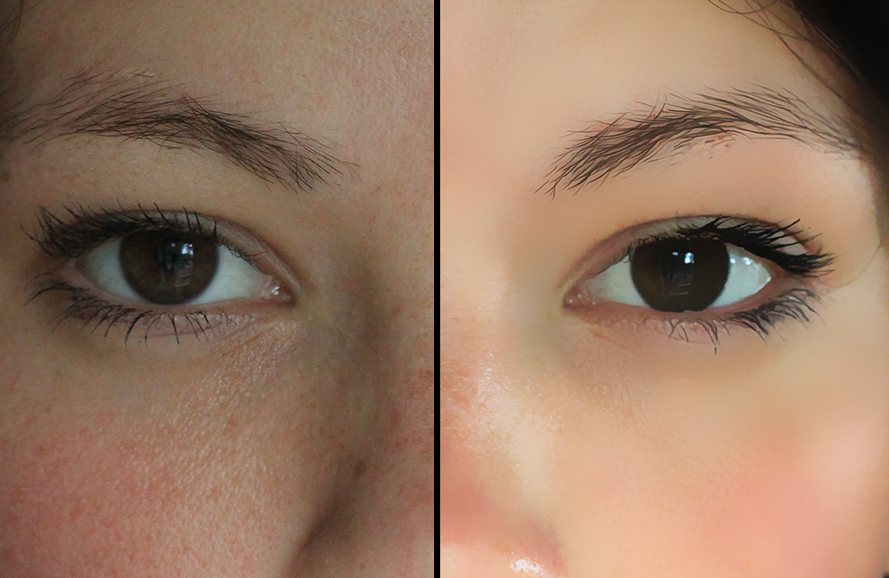
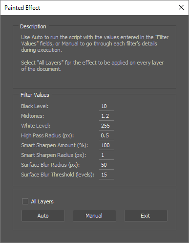

# Painted Effect

`Painted Effect` is a Photoshop script applying a painted-like effect on images, emulating digital painted photos.

## Installation

* Download and extract `Painted Effect`
* Move `Painted Effect.jsx` to your Photoshop scripts directory
    * OS X: `/Applications/Adobe Photoshop CC 2015/Presets/Scripts`
	* Windows `C:\Program Files\Adobe\Adobe Photoshop CC 2015\Presets\Scripts`
* If Photoshop was running, restart it
* The script will be available in `File > Scripts > Painted Effect`

## Usage

`Painted Effect` provides two options.
* `Auto` executes the script without interruption using the values entered in the filter fields.
* `Manual` prompts the user with each filter's dialog

To get the best results, use the `Manual` option with high resolution photos. `Auto` is useful for quick previews, and for running the script through multiple layers(animations etc). In that case, it is best to first run the script with `Manual` mode on one layer to get the filter values best suited to you.

## Screenshot

## Credits

`Painted Effect` filter usage is based on the [Realistic Painted Effect Tutorial](http://blog.spoongraphics.co.uk/tutorials/how-to-create-a-realistic-painted-effect-in-photoshop) by [Chris Spooner](http://blog.spoongraphics.co.uk/)

Example photo by [beautiful-horses](http://beautiful-horses.deviantart.com)

## License
Copyright © 2015 Akis Manolis https://github.com/akisman

Painted Effect is licensed under the MIT licence. All rights not explicitly granted in the MIT license are reserved. See the included LICENSE file for more details.